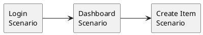

# PlantEdit

A modern, interactive visual editor for PlantUML diagrams with real-time editing capabilities, intelligent auto-routing, and export functionality.

## Overview

PlantEdit is a web-based application that transforms static PlantUML diagrams into interactive, editable visualizations. Write your PlantUML syntax, generate the diagram, and then intuitively rearrange elements through drag-and-drop with automatic edge routing.

## Features

### Core Capabilities
- **PlantUML Syntax Support**: Write diagrams using standard PlantUML syntax
- **Real-time Generation**: Instantly convert PlantUML code to visual diagrams
- **Interactive Editing**:
  - Drag-and-drop entities to rearrange your diagram
  - Mouse wheel zoom for detailed inspection
  - Click and drag background for panning
- **Intelligent Edge Routing**: Automatic orthogonal edge routing using ELKjs with obstacle avoidance
- **Export Options**:
  - Export diagrams as SVG (vector format)
  - Export diagrams as PNG (raster format with high resolution)

### User Interface
- Modern, responsive design with Tailwind CSS
- Collapsible input panel for maximized canvas space
- Live zoom level indicator
- Visual feedback for interactive elements
- Gradient backgrounds with grid patterns for better visualization

## Technologies

Built with modern web technologies:

- **React 18** - UI framework
- **TypeScript** - Type-safe development
- **Vite** - Fast build tool and dev server
- **D3.js** - Interactive data visualization and drag behavior
- **ELKjs** - Sophisticated graph layout with orthogonal routing
- **Dagre** - Graph layout algorithms
- **PlantUML Encoder** - Converting PlantUML syntax to diagram requests
- **Tailwind CSS** - Utility-first CSS framework

## Installation

### Prerequisites
- Node.js (v16 or higher)
- npm or yarn package manager

### Setup

1. Clone the repository:
```bash
git clone https://github.com/SaeedNMosleh/PlantEdit.git
cd PlantEdit
```

2. Install dependencies:
```bash
npm install
```

3. Start the development server:
```bash
npm run dev
```

4. Open your browser and navigate to the URL shown in the terminal (typically `http://localhost:5173`)

## Usage

### Creating a Diagram

1. **Write PlantUML Syntax**: Enter your PlantUML code in the left panel. Example:


2. **Generate**: Click the "Generate Diagram" button to create the visual representation

3. **Edit Interactively**:
   - Drag entities to reposition them
   - Use mouse wheel to zoom in/out
   - Click and drag the background to pan
   - Watch as connections automatically reroute around obstacles

4. **Export**: Use the toolbar buttons to export your diagram as SVG or PNG

### Tips
- Use `skinparam linetype ortho` in your PlantUML code for orthogonal (right-angled) connections
- Use `left to right direction` or `top to bottom direction` to set initial layout
- Collapse the input panel using the arrow button for more canvas space

## Available Scripts

- `npm run dev` - Start development server with hot reload
- `npm run build` - Build for production (TypeScript compilation + Vite build)
- `npm run preview` - Preview production build locally
- `npm run lint` - Run ESLint to check code quality
- `npm run type-check` - Run TypeScript compiler without emitting files

## Project Structure

```
PlantEdit/
├── src/
│   ├── components/
│   │   └── CorrectPlantUMLEditor.tsx    # Interactive SVG editor with drag-and-drop
│   ├── services/
│   │   └── SimplePlantUMLClient.ts      # PlantUML API client
│   ├── App.tsx                          # Main application component
│   ├── App.css                          # Application styles
│   └── main.tsx                         # Application entry point
├── public/                              # Static assets
├── index.html                           # HTML template
├── package.json                         # Project dependencies and scripts
├── vite.config.ts                       # Vite configuration
├── tsconfig.json                        # TypeScript configuration
├── tailwind.config.js                   # Tailwind CSS configuration
└── README.md                            # This file
```

## How It Works

### Architecture

1. **PlantUML Processing**:
   - User-provided PlantUML syntax is encoded and sent to PlantUML servers
   - Server returns an SVG representation of the diagram

2. **SVG Parsing**:
   - The CorrectPlantUMLEditor component parses the SVG
   - Identifies entities (rectangles with text) and links (paths between entities)
   - Builds internal data structures for efficient manipulation

3. **Interactive Editing**:
   - D3.js provides drag behavior with precise pointer offset tracking
   - Entity positions are updated in real-time as user drags
   - ELKjs recalculates optimal orthogonal paths for connections during dragging
   - Arrowheads are reoriented based on final edge segments

4. **Export**:
   - SVG export: Direct serialization of the current SVG DOM
   - PNG export: Renders SVG to canvas with 2x scaling for high quality, then exports as PNG

### Key Features Implementation

- **Auto-routing**: Uses ELKjs layout engine with orthogonal edge routing algorithm
- **Obstacle Avoidance**: ELKjs considers entity positions when routing edges
- **Performance**: RequestAnimationFrame throttling for smooth drag updates
- **Zoom and Pan**: D3 zoom behavior with entity drag detection to prevent conflicts

## Browser Compatibility

PlantEdit works best in modern browsers:
- Chrome/Edge (recommended)
- Firefox
- Safari

## Contributing

Contributions are welcome! Please feel free to submit issues, fork the repository, and create pull requests.

### Development Guidelines
1. Follow the existing code style
2. Ensure TypeScript types are properly defined
3. Test interactive features across different browsers
4. Run `npm run lint` before committing
5. Run `npm run type-check` to verify type safety

## License

This project is open source. Please check the repository for license details.

## Acknowledgments

- **PlantUML**: For the powerful diagram generation engine
- **ELKjs**: For sophisticated graph layout algorithms
- **D3.js**: For interactive visualization capabilities

## Support

For issues, questions, or feature requests, please open an issue on the GitHub repository.

---

Made with React, TypeScript, and a passion for better diagram editing.
